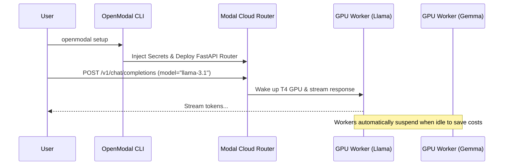

# 🌩️ OpenModal

**Your own private, serverless OpenAI API.** Deploy open-source LLMs to cloud GPUs with one command, and pay exactly $0.00 when you aren't chatting.

 <!-- Replace with your actual GIF -->

## ✨ Features

- 🚦 **Scale-to-Zero Routing:** The router spawns specific GPU containers (L4/T4) on-demand based on the `model` you request, and turns off instantly when you are done.
- ⚡ **Zero-Config Installer:** No Dockerfiles, no cloud consoles. Just type `openmodal setup` and we handle all authentication, cloud secret injection, and deployment automatically.
- 🤖 **Universal Compatibility:** Strict OpenAI API compliance. Use it seamlessly with Cursor, LangChain, CrewAI, Halucintron, or AutoGen.
- 💸 **Cost Tracker:** Built-in terminal dashboard (`openmodal usage`) to monitor exactly what you spend down to the cent.

---

## 🛠️ Quickstart (1 Minute)

### 1. Install the CLI
Install OpenModal directly from PyPI:
```bash
pip install open-modal
```

### 2. Deploy your Router
Deploy your private serverless cloud with one command:
```bash
openmodal setup
```
*The CLI will automatically prompt you to log into Modal, generate a secure API key, and select which models you want to host (Llama 3.1, Gemma, Qwen, etc).*

### 3. Start Chatting
Once deployed, you can immediately test it in your terminal:
```bash
openmodal chat
```

---

## 🏗️ Architecture

Under the hood, OpenModal dynamically provisions highly optimized `llama.cpp` workers running on dedicated cloud GPUs using [Modal](https://modal.com/).



## 🔌 API Usage

Since it acts exactly like OpenAI, just point your favorite SDKs to your new Base URL!

```python
from openai import OpenAI

client = OpenAI(
    base_url="https://<your-workspace>--openmodal-router-web-app.modal.run/v1",
    api_key="your-secure-key"
)

response = client.chat.completions.create(
    model="llama-3.1",
    messages=[{"role": "user", "content": "Hello world!"}],
    stream=True
)

for chunk in response:
    print(chunk.choices[0].delta.content or "", end="")
```

## 💰 Pricing & Free Tier

OpenModal relies on Modal's cloud infrastructure. Modal provides **$30 per month in free credits** to all users (requires adding a payment method to verify identity).

Because OpenModal scales to zero, you are only charged when tokens are actively generating. For personal use, it is almost impossible to exceed the $30/month free tier.

Check your usage anytime:
```bash
openmodal usage
```
